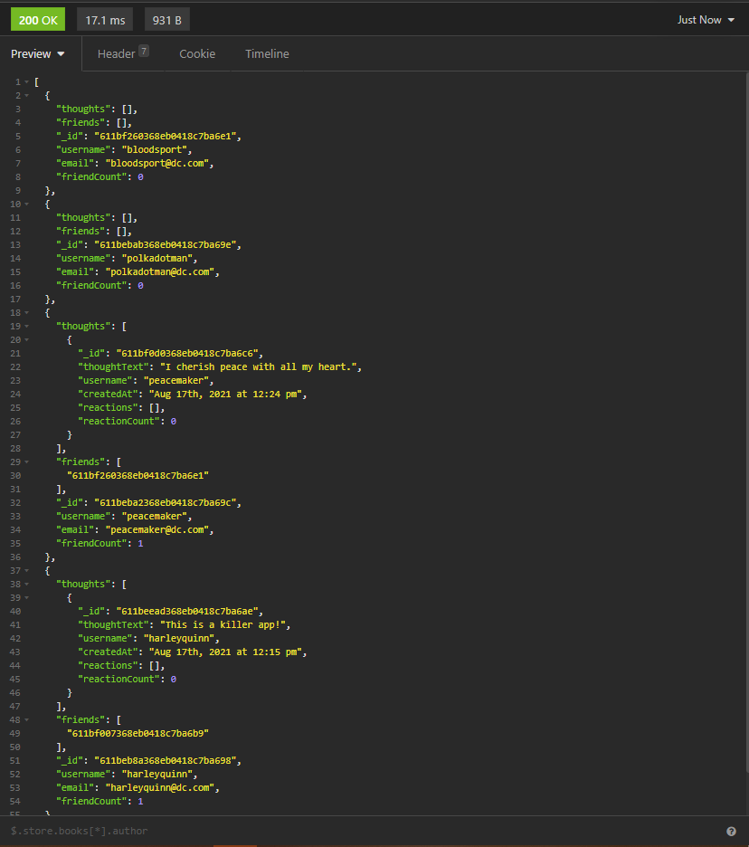
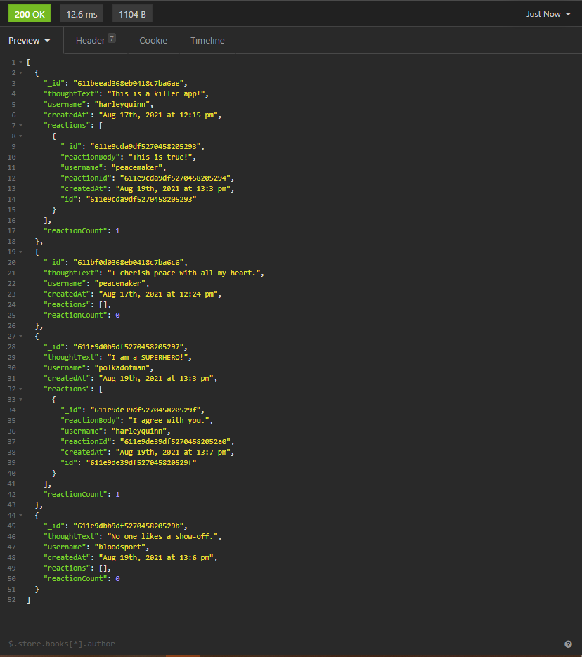

# NoSQL Social Network

## License
  

## Description
An API for a social network web application where users can share their thoughts, react to friends’ thoughts, and create a friend list

## Screenshots
### GET users route

### GET thoughts route

## Walkthroughs

### User Routes

- [Click here for link](https://drive.google.com/file/d/1vjk6W_Sl8CYcbOhTbw2Is01lDSlCLLyd/view)

### Thought Routes

- [Click here for link](https://drive.google.com/file/d/1S6fCFN9kHkGdznrLSSchNkY_Bi0Z49zV/view)

## Table of Contents
  * [Installation](#installation)
  * [Usage](#usage)
  * [Contributing](#contributing)
  * [Questions](#questions)
        
## Installation
Enter `npm install` in the terminal to install the necessary dependencies.
   
## Usage
- Enter `node server.js` or `npm start` to connect to the localhost.
- Use Insomnia to test user and thought routes.

## Contributing
Charity Rogers

## Questions
If you have any questions or concerns, please contact me!

  - GitHub: https://github.com/rogerscl116
  - Email: rogerscl116@gmail.com
